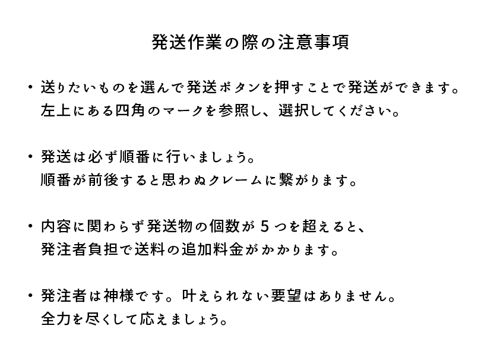

<!DOCTYPE html5>
<html lang=“ja”>

<head>
    <metahttp-equiv="content-type" content="text/html; charset=UTF-8">
	<meta name="viewport" content="width=device-width,initial-scale=1">
    <title>発注ページ</title>
	 <link rel="shortcut icon" href="image/nazobu.jpg" >
	<!-- jQuery本体の読み込み -->
	 <link rel="stylesheet" href="index.css"　type="text/css" media="all">
	 

<!-- ＃リンクのスムーズスクロール -->

</head>

<body>

<header class="header">

      <!-- ハンバーガーメニュー部分 -->
      

        
        <!-- ハンバーガーメニューの表示・非表示を切り替えるチェックボックス -->
        <input id="drawer_input" class="drawer_hidden" type="checkbox">
	

        <!-- ハンバーガーアイコン -->
	<label for="drawer_input" class="drawer_open"></label>
	<label class="drawer_open2"></label>

    
      

    </header>

	
発送するものを選び、 発送ボタンを押しましょう。

	

	
	

	

<input type="checkbox" id="one">
<input type="checkbox" id="two">
<input type="checkbox" id="three">
<input type="checkbox" id="four">
<input type="checkbox" id="five">
<input type="checkbox" id="six">
<input type="checkbox" id="seven">
<input type="checkbox" id="eight">
<input type="checkbox" id="nine">

<label class="label-btn1" for="one">1</label>
<label class="label-btn2" for="two">2</label>
<label class="label-btn3" for="three">3</label>
<label class="label-btn4" for="four">4</label>
<label class="label-btn5" for="five">5</label>
<label class="label-btn6" for="six">6</label>
<label class="label-btn7" for="seven">7</label>
<label class="label-btn8" for="eight">8</label>
<label class="label-btn9" for="nine">9</label>

<input type="button" id="send" onClick="link()" style="display:none">

<label class="label-send" for="send">発送</label>

  
  </body>
